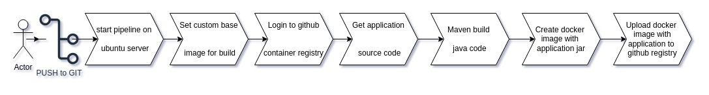

# spring-application-template

## Manual build

Build command
```bash
mvn clean package
```
Test command
```bash
mvm verify
```

## Run in docker compose

Deploy application container env in docker use compose
```bash
docker-compose build
docker-compose up
```

Destroy application env
```bash
docker-compose down
```

Local application url: http://localhost:8080/swagger-ui/index.html

## GitHub pipeline description


## Github build
- https://github.com/kostakoff/spring-application-template/pkgs/container/spring-application-template
- https://github.com/kostakoff/spring-application-template/actions

## Deploy to kubernetes
This deploy will pull follow docker images:
- nginx form docker-hub: docker.io/kostakoff/rocky-base-images:8-nginx
- application from github: ghcr.io/kostakoff/spring-application-template:latest

Deployment:
- go to deployment folder
```bash
cd ./Deployment
```
- render helm chart
```bash
helm template my-application ./my-application -f ./my-application/values-secrets.yaml
```
- install helm chart
```bash
helm install my-application ./my-application -f ./my-application/values-secrets.yaml
```
- update deploy
```bash
helm upgrade --install my-application ./my-application -f ./my-application/values-secrets.yaml
```
- remove helm chart
```bash
helm uninstall my-application
```
Link for microk8s: https://application.k8s.localhost/swagger-ui/index.html
